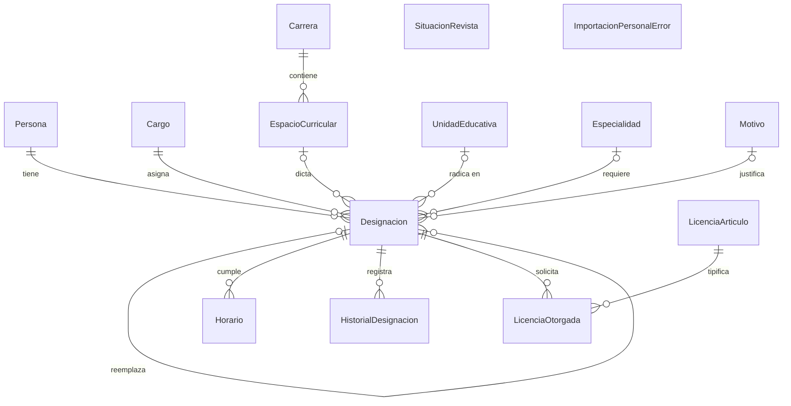

```mermaid
erDiagram
    %% Módulo Personal
    Persona ||--o{ Designacion : "tiene"
    Cargo ||--o{ Designacion : "asigna"
    Carrera ||--o{ EspacioCurricular : "contiene"
    EspacioCurricular |o--o{ Designacion : "dicta"
    UnidadEducativa |o--o{ Designacion : "radica en"
    Especialidad |o--o{ Designacion : "requiere"
    Motivo |o--o{ Designacion : "justifica"
    Designacion |o--o{ Designacion : "reemplaza"
    Designacion ||--o{ Horario : "cumple"
    Designacion ||--o{ HistorialDesignacion : "registra"

    %% Módulo Licencias
    LicenciaArticulo ||--o{ LicenciaOtorgada : "tipifica"
    Designacion ||--o{ LicenciaOtorgada : "solicita"

    SituacionRevista
    ImportacionPersonalError 
```